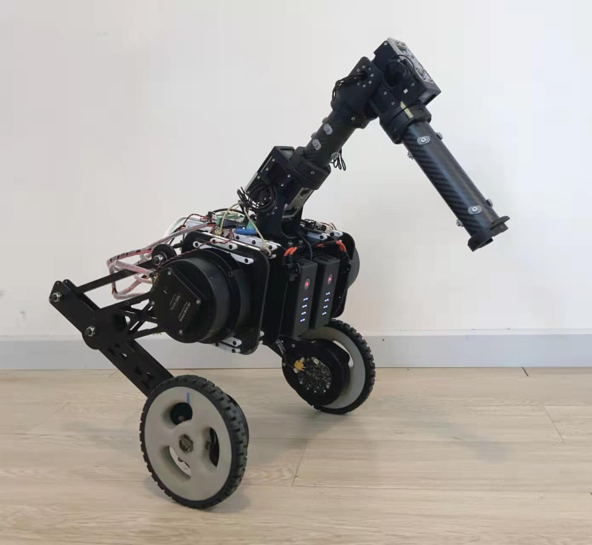
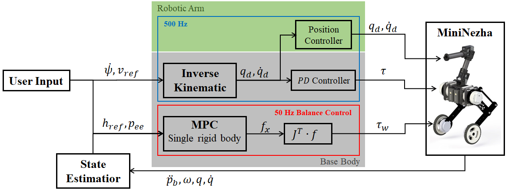

## Education

2019.09 - 2021.05 Master of Science in Mechanical Engineering(Robotics Tracks), Columbia University 

2015.09 - 2019.07 Bachelor of Science in Marine Engineerinng, Huazhong University of Science and Technology

## Publication
Boxi Xia, Zhicheng Song†, Jiaming Fu†, Hongbo Zhu†, Yibo Jiang, Hod Lipson, “A Legged Soft Robot Platform for Dynamic Locomotion”, ICRA, 2021. († These authors contributed equally to this work.)

## Research interets
Mechanical design and manufacture of bipedal/quadrupedal/wheeled/soft robot, Control and learning-based control for robot

## Research experience

### Design and Control of Wheeled-Bipedal Robot _(Ongoing)_    

Advisor: Wei Zhang  
CLEAR LAB, Southern University of Science and Technology  

 

<iframe width="560" height="315" src="https://www.youtube.com/embed/IS4vOGlrugQ" title="YouTube video player" frameborder="0" allow="accelerometer; autoplay; clipboard-write; encrypted-media; gyroscope; picture-in-picture" allowfullscreen></iframe>

>**Abstract**We present the design of mechanical structure and control scheme for a wheeled bipedal robot \textit{MiniNezha}, which is built to handle various indoor environment tasks. By combining the advantages of both legs and wheels structure, the robot can move fast on flat surface and has the ability to overcome sophisticated terrains. The robotic arm attached to the body enables the robot to perform manipulation tasks as well. To effectively control the MiniNezha robot, we propose a convex model predictive control-based strategy, which integrates the functionality of balancing and end-effector control. The proposed controller approximates the robot as a single rigid body and incorporates the dynamical effects of the attached arm. In doing so, the convex MPC-based strategy improves the stability while moving the arm. Experiments are conducted both in simulation and real-world to validate the mechanical design of the MiniNezha robot and the proposed control method.
>
>In this project, My contributes are list as below:  
>    **Hardware**: Designed and manufactured the whole robobt and the PCB board inside it.  
>    **Software**: Created the robots’ URDFs and simulated it in MuJuCo; Accomplished the robotic arm's null-space control; Balance the robot based on LQR/PID/MPC controller.

### Soft Quadrupedal Robot with Bipedal Running Function _(2020.11 - 2021.05)_

Advisor: Hod Lipson  
Creative Machicnes Lab, Columbia University

  
  

<iframe width="560" height="315" src="https://www.youtube.com/embed/fAjOaO8Wtlg" title="YouTube video player" frameborder="0" allow="accelerometer; autoplay; clipboard-write; encrypted-media; gyroscope; picture-in-picture" allowfullscreen></iframe>

  

>Based on the [Flexipod](https://boxixia.github.io/Flexipod/) we bulit, we develop it from a 4 DOF soft robot into a 12 DOF soft robot. With Flexipod2.0 we utilized >reinforcement learning to make it run both in bipedal and quadrupedal. This project is still ongoing, I'll update more information once it is finished.  
>
>In this project, My contributes are list as below:  
>    **Hardware**: Designed and manufactured the whole robobt and the PCB board inside it. Designed and manufactured a simple cable-driven leg.  
>    **Software**: Created the robots’ URDFs and simulated it in Pybullet to choose motor; Utilized standard reinforcement learning algorithm(DDPG, PPO) to make the >    robot run and stand in bipedal form; Accomplished real-time on-board camera streaming in C++.

### Soft Quadrupedal Robot Actuated by BLDC motor _(2020.02 - 2020.10)_

Advisor: Hod Lipson  
Creative Machicnes Lab, Columbia University

<iframe width="560" height="315" src="https://www.youtube.com/embed/3h0RwY_tpGc" title="YouTube video player" frameborder="0" allow="accelerometer; autoplay; clipboard-write; encrypted-media; gyroscope; picture-in-picture" allowfullscreen></iframe>

>**Abstract**—We present an open-source untethered quadrupedal soft robot platform for dynamic locomotion (e.g., high-speed running and backflipping). The robot is >mostly soft (80 vol.%) while driven by four geared servo motors. The robot’s soft body and soft legs were 3D printed with gyroid infill using a flexible material, >enabling it to conform to the environment and passively stabilize during locomotion on multi-terrain environments. In addition, we simulated the robot in a real-time >soft body simulation. With tuned gaits in simulation, the real robot can locomote at a speed of 0.9 m/s (2.5 body length/second), substantially faster than most >untethered legged soft robots published to date. We hope this platform, along with its verified simulator, can catalyze the development of soft robotics.  
>
>In this project, My contributes are listed as below:  
>    **Hardware**: Designed and manufactured the whole robobt and the PCB board inside it. Designed a waterproof structure to allow the robot run under shallow water.  
>    **Software**: Created the robots’ URDFs and simulated it in Pybullet to probe how the robot’s structure influences the agility of robot; Accomplished real-time >    on-board camera streaming in python.
>
>For more information please visit [Flexipod](https://boxixia.github.io/Flexipod/)
