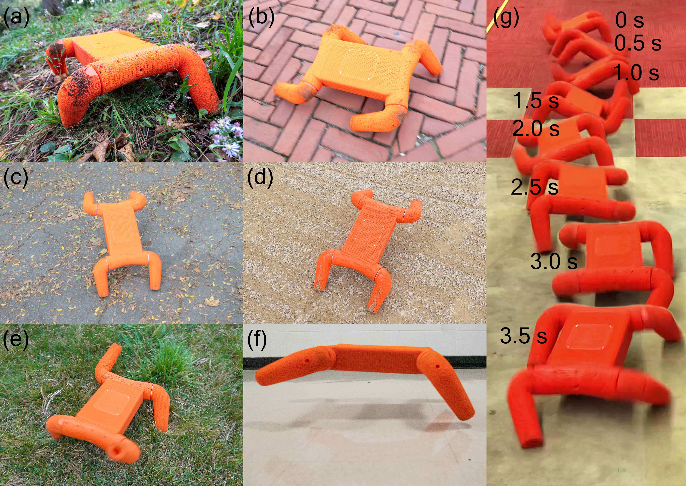

## Education

2019.09 - 2021.05 Master of Science in Mechanical Engineering(Robotics Tracks), Columbia University 

2015.09 - 2019.07 Bachelor of Science in Marine Engineerinng, Huazhong University of Science and Technology

## Publication
Boxi Xia, Zhicheng Song†, Jiaming Fu†, Hongbo Zhu†, Yibo Jiang, Hod Lipson, “A Legged Soft Robot Platform for Dynamic Locomotion”, ICRA, 2021. († These authors contributed equally to this work.)

## Research interets
Mechanical design and manufacture of bipedal/quadrupedal/wheeled/soft robot, Control and learning-based control for robot

## Research experience

### Design and Control of Wheeled-Bipedal Robot _(Ongoing)_    

Advisor: Wei Zhang  
CLEAR LAB, Southern University of Science and Technology

### Soft Quadrupedal Robot with Bipedal Running Function _(2020.11 - 2021.05)_

Advisor: Hod Lipson  
Creative Machicnes Lab, Columbia University

### Soft Quadrupedal Robot Actuated by BLDC motor _(2020.02 - 2020.10)_

Advisor: Hod Lipson  
Creative Machicnes Lab, Columbia University


<div></div>


Abstract—We present an open-source untethered quadrupedal soft robot platform for dynamic locomotion (e.g., high-speed running and backflipping). The robot is mostly soft (80 vol.%) while driven by four geared servo motors. The robot’s soft body and soft legs were 3D printed with gyroid infill using a flexible material, enabling it to conform to the environment and passively stabilize during locomotion on multi-terrain environments. In addition, we simulated the robot in a real-time soft body simulation. With tuned gaits in simulation, the real robot can locomote at a speed of 0.9 m/s (2.5 body length/second), substantially faster than most untethered legged soft robots published to date. We hope this platform, along with its verified simulator, can catalyze the development of soft robotics.

### Markdown

Markdown is a lightweight and easy-to-use syntax for styling your writing. It includes conventions for

```markdown
Syntax highlighted code block

# Header 1
## Header 2
### Header 3

- Bulleted
- List

1. Numbered
2. List

**Bold** and _Italic_ and `Code` text

[Link](url) and 
```

For more details see [GitHub Flavored Markdown](https://guides.github.com/features/mastering-markdown/).

### Jekyll Themes

Your Pages site will use the layout and styles from the Jekyll theme you have selected in your [repository settings](https://github.com/ZhichengSong6/ZhichengSong6.github.io/settings/pages). The name of this theme is saved in the Jekyll `_config.yml` configuration file.

### Support or Contact

Having trouble with Pages? Check out our [documentation](https://docs.github.com/categories/github-pages-basics/) or [contact support](https://support.github.com/contact) and we’ll help you sort it out.
