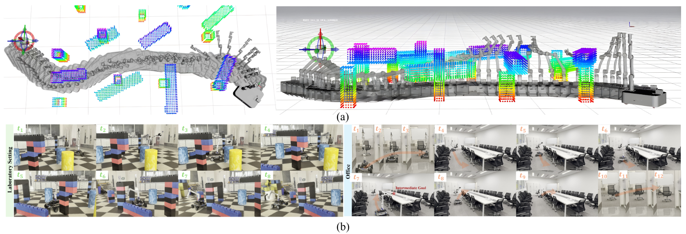
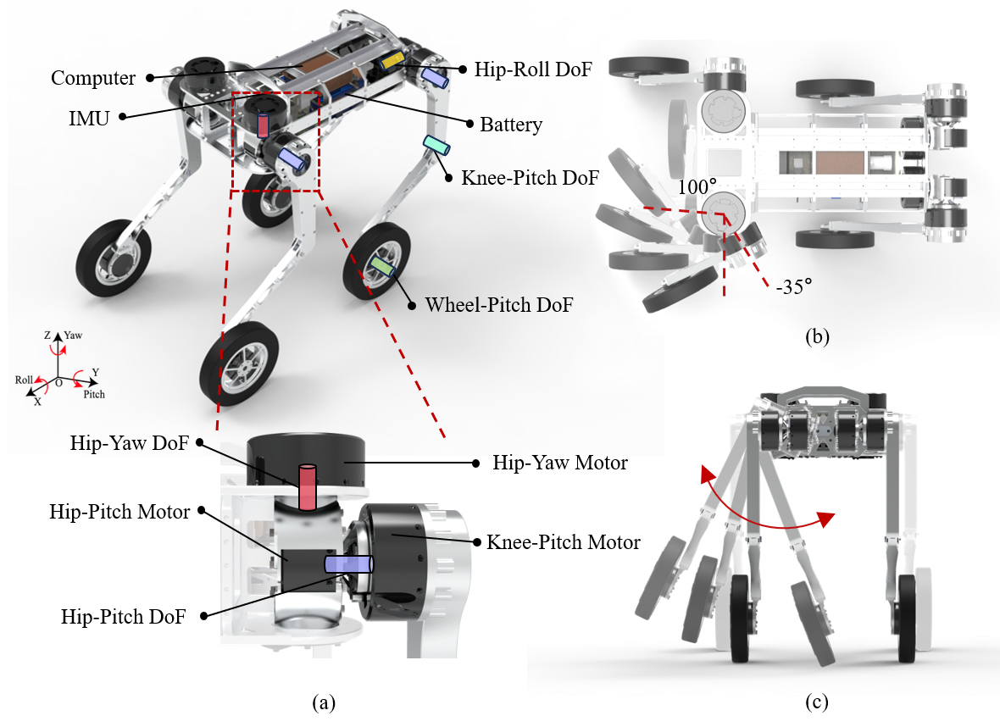
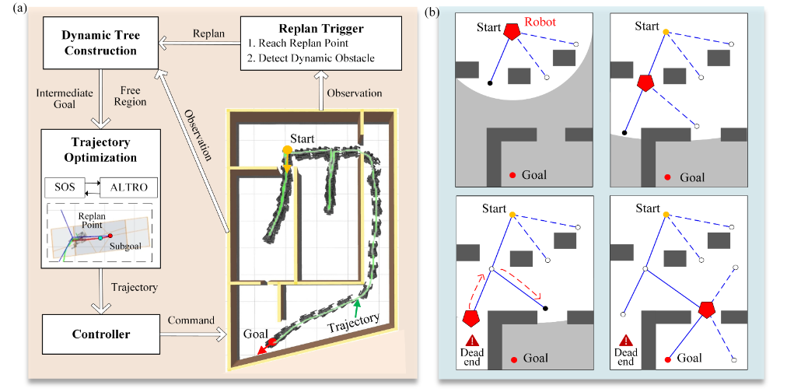
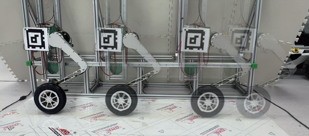
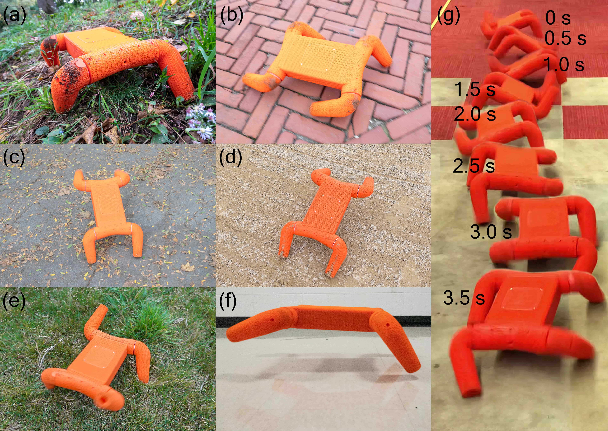

# Zhicheng Song

I am a Ph.D. student in Robotics and Autonomous Systems at [The Hong Kong University of Science and Technology (Guangzhou)](https://www.hkust-gz.edu.cn/), advised by [Prof. Jun Ma](https://personal.hkust-gz.edu.cn/junma/index.html). I am affiliated with the [Intelligent Autonomous Driving Center (IADC)](https://personal.hkust-gz.edu.cn/junma/Join.html) and the [Robot Motion Planning and Control Lab](https://personal.hkust-gz.edu.cn/junma/index.html).

My research focuses on robotic motion planning, safe autonomy, and robot design, with an emphasis on enabling robots to operate reliably in complex, cluttered, and partially unknown environments. I am broadly interested in safe motion planning, robot perception, mobile manipulation, legged and wheeled-legged robots, and learning-based robot control.

Before joining HKUST(GZ), I received my M.S. degree in Mechanical Engineering with a Robotics Track from [Columbia University](https://www.columbia.edu/), where I worked with [Prof. Hod Lipson](https://www.me.columbia.edu/faculty/hod-lipson) at the [Creative Machines Lab](https://www.creativemachineslab.com/). I received my B.S. degree in Marine Engineering from [Huazhong University of Science and Technology](https://english.hust.edu.cn/).

---

## Publications

<!-- Please see my [Google Scholar](#) for a full list of publications. -->

  

    
  

  

    
Safe Navigation in Unknown and Cluttered Environments via Direction-Aware Convex Free-Region Generation

    
<strong>Zhicheng Song</strong>, Yongjian Li, Kai Chen, Yulin Li, Fan Shi, and Jun Ma

    
arXiv preprint arXiv:2604.23648, 2026

    

      safe navigation
      motion planning
      convex free region
    

    

      <a href="https://arxiv.org/pdf/2604.23648">PDF</a>
      <a href="https://github.com/ZhichengSong6/FRGraph">WEBSITE</a>
    

  

  

    
  

  

    
Fast and Safe Trajectory Optimization for Mobile Manipulators With Neural Configuration Space Distance Field

    
Yulin Li, Zhiyuan Song, Yiming Li, <strong>Zhicheng Song</strong>, Kai Chen, Chunxin Zheng, Zhihai Bi, Jiahang Cao, Sylvain Calinon, Fan Shi, and Jun Ma

    
arXiv preprint arXiv:2601.18548, 2026

    

      mobile manipulator
      trajectory optimization
      collision avoidance
      neural distance field
    

    

      <a href="https://arxiv.org/pdf/2601.18548">PDF</a>
      <a href="https://yulinli0.github.io/GCDF/">WEBSITE</a>
    

  

  

    
  

  

    
A Reconfigured Wheel-Legged Robot for Enhanced Steering and Adaptability

    
<strong>Zhicheng Song</strong>, Jinglan Xu, Chunxin Zheng, Yulin Li, Zhihai Bi, and Jun Ma

    
IEEE Robotics and Automation Letters, 2026

    

      wheel-legged robot
      robot design
      locomotion
    

    

      <a href="https://ieeexplore.ieee.org/document/11495517">PDF</a>
      <a href="https://github.com/ZhichengSong6/FLORES">WEBSITE</a>
    

  

  

    
  

  

    
FRTree Planner: Robot Navigation in Cluttered and Unknown Environments with Tree of Free Regions

    
Yulin Li, <strong>Zhicheng Song(Co-first)</strong>, Chunxin Zheng, Zhihai Bi, Kai Chen, Michael Yu Wang, and Jun Ma

    
IEEE Robotics and Automation Letters, 2025

    

      robot navigation
      free region
      unknown environments
    

    

      <a href="https://ieeexplore.ieee.org/document/10897898/">PDF</a>
      <a href="https://github.com/YulinLi0/navigation_with_tree_of_free_regions">WEBSITE</a>
    

  

  

    
  

  

    
State Estimation for Wheeled-Legged Robot with Slip Detection

    
Jinglan Xu, <strong>Zhicheng Song</strong>, Chunxin Zheng, and Jun Ma

    
IEEE International Conference on Robotics and Biomimetics (ROBIO), 2024

    

      wheeled-legged robot
      state estimation
      slip detection
    

    

      <a href="https://ieeexplore.ieee.org/abstract/document/10907492">PDF</a>
    

  

  

    
  

  

    
A Legged Soft Robot Platform for Dynamic Locomotion

    
Boxi Xia, Jiaming Fu, Hongbo Zhu, <strong>Zhicheng Song</strong>, Yibo Jiang, and Hod Lipson

    
IEEE International Conference on Robotics and Automation (ICRA), 2021

    

      soft robot
      dynamic locomotion
      robot design
    

    

      <a href="https://ieeexplore.ieee.org/document/9561018">PDF</a>
      <a href="https://boxixia.github.io/Flexipod/">WEBSITE</a>
    

  

---

## Contact

Email: [zsong469@connect.hkust-gz.edu.cn](mailto:zsong469@connect.hkust-gz.edu.cn)  
<!-- Google Scholar: [Google Scholar](#)   -->
GitHub: [GitHub](https://github.com/ZhichengSong6)